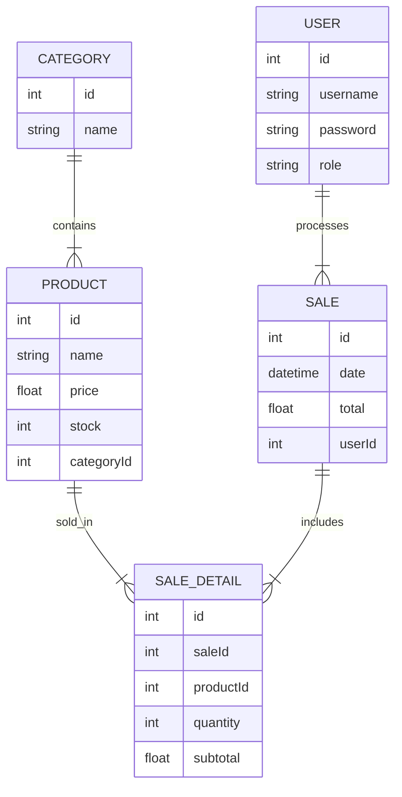

# 🛒 Sistema de Inventario y Punto de Venta (POS)

📌 **Proyecto Fullstack — Backend y Frontend en repos separados**  
👥 **Equipo máximo:** 4 integrantes  
🛠 **Tecnologías:** Node.js · TypeScript · MySQL · Vue 3 · Pinia  

---

## 📘 Descripción General

Este proyecto tiene como objetivo desarrollar un **Sistema de Punto de Venta (POS)** con control de inventario integrado.  
El sistema permite gestionar:

- productos  
- categorías  
- ventas  
- usuarios  
- reportes  

Está orientado a pequeñas tiendas que actualmente dependen de medios manuales como **Excel o libretas**, generando:

- ❌ errores de inventario  
- ❌ pérdidas por mala gestión  
- ❌ ausencia de reportes confiables  

✔ **El objetivo general es digitalizar completamente el flujo de ventas y el control de inventario.**

---

## 🎯 Objetivos del Sistema

- Crear un **punto de venta eficiente y fácil de usar**
- Controlar existencias en tiempo real
- Registrar ventas mediante un sistema de **carrito**
- Generar reportes confiables
- Administrar productos y categorías
- Implementar **roles** para control de acceso

---

## 📦 Alcance del Proyecto

### ✔ In-Scope (Obligatorio)
- Gestión completa de productos  
- Gestión de categorías  
- Ventas tipo carrito  
- Actualización automática de inventario  
- Reportes de ventas  
- Roles: **Admin** y **Vendedor**  
- Interfaz SPA (Vue 3 + Router)  
- API REST con JWT  

### ❌ Fuera de alcance (Opcional / No obligatorio)
- Control de caja  
- Corte de turno  
- Múltiples sucursales  
- Facturación electrónica  

---

## 🧩 Módulos del Sistema

### 1. 🔐 Autenticación
- Login de usuarios  
- JWT  
- Roles: administrador y vendedor  

### 2. 📦 Productos
CRUD completo  
**Campos:**
- nombre  
- categoría  
- precio  
- stock  
- código/SKU  

### 3. 🏷️ Categorías
- Crear  
- Editar  
- Eliminar  
- Listar  

### 4. 🛒 Ventas
- Carrito de compras  
- Registro de venta  
- Actualización de stock en tiempo real  
- Cálculo automático del total  

### 5. 📊 Reportes
- Ventas por día  
- Ventas por semana  
- Ventas por mes  
- Producto más vendido  

### 6. 📈 Dashboard
- Gráficas simples  
- Indicadores clave  

---

## 👤 Historias de Usuario

### 🧍‍♂️ Administrador
> “Como administrador, quiero registrar productos para mantener actualizado el inventario.”

> “Como administrador, quiero ver reportes diarios para conocer las ventas del negocio.”

### 🧍‍♂️ Vendedor
> “Como vendedor, quiero procesar ventas rápidamente para atender de forma ágil.”

> “Como vendedor, quiero buscar productos rápido para no perder tiempo en caja.”

---

## 🛠 Tecnologías

### 🔧 Backend
- Node.js  
- TypeScript  
- Express  
- MySQL  
- Prisma *o* Sequelize  
- JWT  
- Bcrypt  
- Zod

### 🎨 Frontend
- Vue 3  
- Pinia  
- Vue Router  
- TailwindCSS  
- Axios  

---

## 🏛 Arquitectura del Proyecto

Arquitectura basada en **capas**, separando responsabilidades:

# 🗂️ Estructura del Backend — POS (Node.js + TypeScript + MySQL)

El backend está basado en una arquitectura **por capas profesional**, usando Node.js, Express, TypeScript y Prisma/Sequelize.  
La estructura completa es la siguiente:

```plaintext
pos-backend/
├── prisma/                 # (si se usa prisma)
├── src/
│   ├── config/
│   │   ├── db.ts
│   │   └── env.ts
│   ├── models/
│   │   ├── product.model.ts
│   │   ├── category.model.ts
│   │   └── user.model.ts
│   ├── repositories/
│   │   ├── product.repository.ts
│   │   ├── category.repository.ts
│   │   └── user.repository.ts
│   ├── services/
│   │   ├── product.service.ts
│   │   └── auth.service.ts
│   ├── controllers/
│   │   ├── product.controller.ts
│   │   ├── category.controller.ts
│   │   └── auth.controller.ts
│   ├── routes/
│   │   ├── product.routes.ts
│   │   ├── category.routes.ts
│   │   └── auth.routes.ts
│   ├── middleware/
│   │   └── auth.middleware.ts
│   ├── utils/
│   │   ├── errorHandler.ts
│   │   └── jwt.ts
│   ├── app.ts
│   └── server.ts
├── .env.example
└── README.md
```

---

## 🗂 Estructura del Frontend (Vue 3)

```plaintext
pos-frontend/
├── src/
│   ├── api/
│   │   ├── http.ts
│   │   └── product.api.ts
│   ├── store/
│   │   ├── auth.store.ts
│   │   └── products.store.ts
│   ├── router/
│   │   └── index.ts
│   ├── views/
│   │   ├── LoginView.vue
│   │   ├── DashboardView.vue
│   │   ├── ProductsView.vue
│   │   ├── SalesView.vue
│   │   └── ReportsView.vue
│   ├── components/
│   │   ├── products/
│   │   │   └── ProductForm.vue
│   │   ├── sales/
│   │   │   └── CartItem.vue
│   │   └── layout/
│   │       ├── Sidebar.vue
│   │       └── Navbar.vue
│   ├── assets/
│   ├── App.vue
│   └── main.ts
└── .env.example
```

## 📊 Diagrama ER (Modelo de Datos)



## 🚀 Entregables Finales

Cada equipo deberá entregar **todos** los siguientes elementos para completar correctamente el proyecto POS:

### 📡 Backend completo
- API funcional con autenticación JWT  
- Validaciones  
- CRUD de productos, categorías, ventas y usuarios  
- Código organizado por capas (Rutas → Controladores → Servicios → Repositorios)

### 🖥️ Frontend completo
- SPA con Vue 3 + Pinia  
- Rutas públicas y protegidas  
- CRUD funcional  
- Carrito de ventas operativo  
- Interfaz responsiva

### 🗄️ Base de Datos
- Archivo exportado **`.sql`** con todas las tablas y datos mínimos de prueba

### 🎬 Video Demostrativo (3–5 min)
Debe incluir:
- Login  
- Gestión de productos  
- Registro de ventas  
- Actualización automática de inventario  
- Uso del dashboard  
- Reportes  

### 📊 Diagramas
- **ERD (Entidad–Relación)**  
- **Diagrama de arquitectura**  
- **Diagrama de flujo (opcional)**  

### 🧪 Colección Postman
- Todos los endpoints documentados y probados  
- Variables configuradas (URL base, token, etc.)

---

## 🎨 Figma sugerido (opcional)

Plantilla recomendada para el dashboard del POS:

➡️ **Inventory Dashboard UI (Figma)**  
👉 https://www.figma.com/community/file/1200315869750662232/inventory-management-dashboard


→ [HOME](./../README.md)