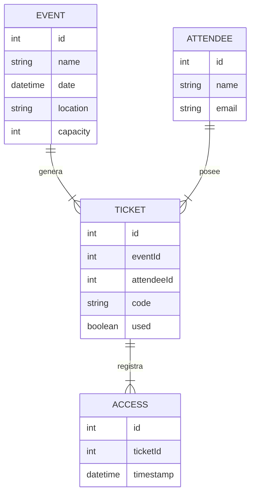

# 🎟️ Sistema de Gestión de Eventos — EventFlow

Registro, venta de boletos, control de invitados y accesos

---

## 📝 Descripción General

EventFlow es un sistema diseñado para facilitar la gestión completa de eventos:

- Registro de eventos  
- Venta/registro de boletos  
- Control de asistentes  
- Validación de accesos (con QR opcional)  
- Control de capacidad  
- Reportes básicos

Es ideal para:

- Conferencias  
- Conciertos pequeños  
- Eventos escolares  
- Talleres o seminarios  

El sistema proporciona herramientas para evitar duplicidad de entradas, mejorar la organización y llevar un control profesional.

---

## 🎯 Objetivos del Sistema

- Facilitar la venta y registro de boletos  
- Evitar duplicidad de accesos  
- Validar asistentes de manera rápida  
- Controlar capacidad del evento  
- Generar reportes de asistencia  
- Gestionar roles administrativos y organizadores  

---

## 📦 Alcance del Proyecto

### ✔ Incluye
- CRUD de eventos  
- CRUD de asistentes  
- Registro de boletos  
- Validación de acceso  
- Dashboard  
- Roles: **admin**, **organizador**  
- Autenticación JWT  
- Reportes básicos  

### ❌ No incluye
- Pasarelas de pago reales  
- Escaneo QR avanzado (solo versión básica opcional)

---

## 🧩 Módulos del Sistema

### 1. Eventos
- Crear, editar y eliminar eventos
- Capacidad máxima
- Fechas, ubicación y descripción

### 2. Boletos
- Generación de boletos
- Código único (ID o QR opcional)
- Validación en acceso

### 3. Asistentes
- Registro manual o automático
- Asignación de boletos
- Estado: confirmado, pendiente, validado

### 4. Registro de Acceso
- Validación de entrada
- Evitar duplicados
- Registro de fecha/hora de acceso

### 5. Dashboard
- Asistencias totales
- Boletos vendidos
- Capacidad restante
- Últimos accesos validados

### 6. Roles y sesiones
- Administrador: controla todo el sistema  
- Organizador: gestiona eventos y asistentes  

---

## 👤 Historias de Usuario

### 👨‍💼 Organizador
> “Como organizador quiero crear eventos para vender boletos.”

> “Como organizador quiero saber cuántos asistentes ya están registrados.”

### 🧑‍💼 Staff
> “Como staff quiero validar el acceso escaneando un código.”

> “Como staff quiero evitar que el mismo boleto sea usado más de una vez.”

---

## 🗄 Modelo ER (Mermaid)



## 🔧 Tecnologías Recomendadas

### 🖥️ Backend
- **PHP 8+**
- **Slim Framework** o **Laravel** (sin frontend integrado)
- **MySQL**
- **JWT** para autenticación
- **PDO** (si se usa Slim)

### 💻 Frontend
- **React**
- **Vite**
- **TailwindCSS + DaisyUI**
- **React Router**
- **Axios** para consumo de API

---

## 📁 Estructura Sugerida del Proyecto

El proyecto debe estar dividido en dos carpetas principales: **backend** y **frontend**.

---

## 📦 Backend (PHP + MySQL)

```plaintext
eventflow-backend/
├── public/
│   └── index.php
├── app/
│   ├── config/
│   ├── controllers/
│   ├── models/
│   ├── routes/
│   ├── middleware/
│   └── utils/
├── vendor/
├── .htaccess
├── .env.example
└── README.md
```

## 💻 Frontend (React + DaisyUI)

```plaintext
eventflow-frontend/
├── src/
│   ├── api/
│   ├── store/
│   ├── pages/
│   ├── components/
│   ├── router/
│   ├── App.jsx
│   └── main.jsx
├── public/
└── README.md
```

## 📄 Entregables Finales

### ✔ API documentada
- Endpoints en **Markdown** o **Swagger**
- Ejemplos completos de **request/response**
- Autenticación **JWT** incluida
- Colección **Postman** (opcional pero recomendada)

---

### ✔ SPA funcional (React)
Incluye:
- Login
- Dashboard
- Gestión de eventos
- Gestión de asistentes
- Boletos
- Validación de acceso
- Interfaz moderna con **DaisyUI**
- Rutas protegidas con JWT

---

### ✔ Base de datos SQL
Debe incluir:
- Script `.sql` con la creación de tablas
- Índices
- Llaves foráneas
- Relaciones correspondientes al modelo ER

---

### ✔ Diagramas
El proyecto debe entregar los siguientes diagramas:

- **Diagrama ER**  
- **Arquitectura del backend**
- **Arquitectura del frontend**
- **Flujo de validación de acceso** (boleto → asistente → verificación)

---

### ✔ Video demostrativo
Duración sugerida: **3–6 minutos**

Debe mostrar:
- Login
- Creación de evento
- Venta/registro de boletos
- Validación de acceso desde panel de staff
- Dashboard y reportes

---

### 🎨 Figma sugerido
Interfaz amigable basada en tarjetas:

👉 https://www.figma.com/community/file/938250776551492197/event-management-dashboard-ui

→ [HOME](./../README.md)