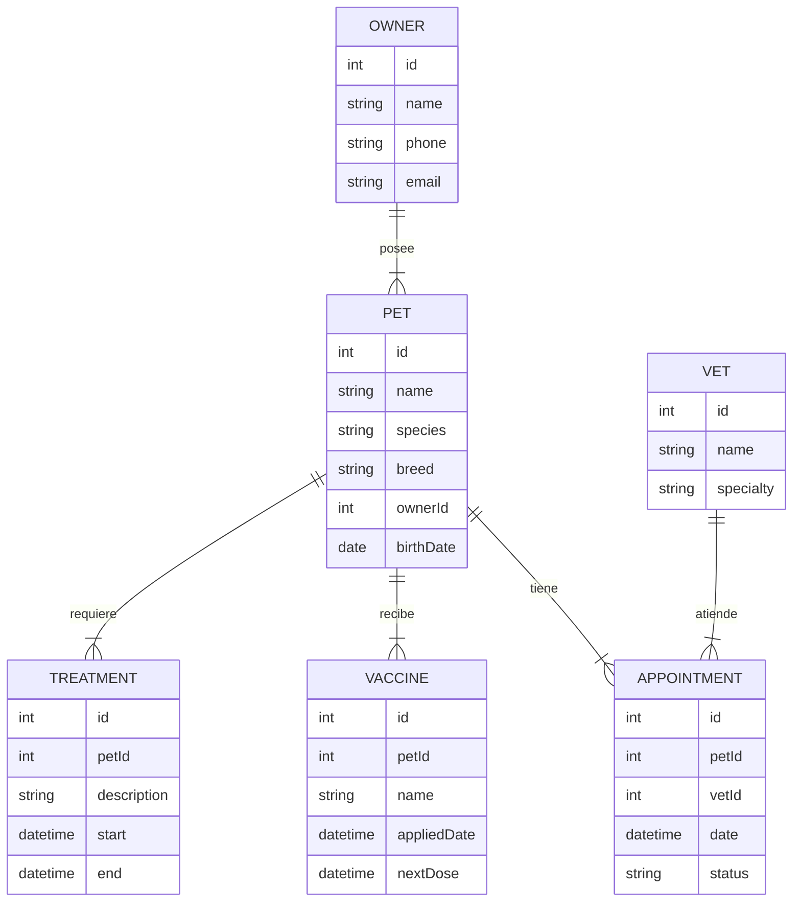

# 🐾 Sistema de Gestión de Clínicas Veterinarias (VetCare System)

Pacientes (mascotas), dueños, citas, tratamientos y vacunas

---

## 📝 Descripción General

**VetCare System** es una plataforma diseñada para la administración de clínicas veterinarias.  
El sistema permite gestionar:

- Mascotas y sus dueños  
- Historial clínico  
- Tratamientos  
- Citas médicas  
- Vacunas  
- Seguimiento médico completo  
- Reportes y estadísticas de la clínica  

El objetivo principal es reemplazar el registro manual y desorganizado por un sistema **digital**, **seguro**, y **eficiente**.

---

## 🎯 Objetivos del Sistema

- Administrar información médica de mascotas.
- Agendar y gestionar citas con veterinarios.
- Registrar vacunas, tratamientos y observaciones.
- Mantener un historial clínico completo.
- Facilitar la atención mediante una UI rápida y organizada.
- Permitir operaciones con múltiples veterinarios.

---

## 📦 Alcance del Proyecto

### ✔ Incluye
- CRUD de **pacientes (mascotas)**
- CRUD de **dueños**
- CRUD de **veterinarios**
- **Citas médicas**
- **Historial clínico**
- **Vacunas** y recordatorios
- **Tratamientos**
- **Dashboard administrativo**
- **Roles**: Admin, Recepcionista, Veterinario
- **JWT** y rutas protegidas

### ❌ No incluye (opcional)
- Facturación
- Inventario de medicamentos
- Tienda en línea
- Diagnósticos automáticos

---

## 🧩 Módulos del Sistema

### 1. Autenticación
- Inicio de sesión  
- Roles:  
  - Admin  
  - Recepcionista  
  - Veterinario  

### 2. Dueños (CRUD)
- Datos personales  
- Información de contacto  
- Relación con mascotas  

### 3. Mascotas (CRUD)
- Nombre  
- Edad  
- Especie y raza  
- Dueño asignado  
- Foto (opcional)

### 4. Citas
- Agendar  
- Reagendar  
- Cancelar  
- Asignar veterinario  

### 5. Historial Médico
- Consultas previas  
- Alergias  
- Tratamientos  
- Cirugías  

### 6. Vacunas
- Registro  
- Fecha de próxima dosis  
- Recordatorios  

### 7. Dashboard
- Citas del día  
- Mascotas nuevas  
- Vacunas por vencer  

---

## 👤 Historias de Usuario

### Recepcionista
- “Como recepcionista quiero registrar dueños y mascotas para agendar citas.”
- “Como recepcionista quiero ver las citas del día para organizar el trabajo.”

### Veterinario
- “Como veterinario quiero consultar la historia clínica antes de revisar a una mascota.”
- “Como veterinario quiero registrar tratamientos o vacunas aplicadas.”

### Administrador
- “Como administrador quiero ver reportes generales de la clínica para tomar decisiones.”

---

# 🗄 Modelo ER sugerido (MySQL)



# 🛠 Tecnologías Sugeridas

## Backend
- Node.js  
- TypeScript  
- Express  
- Prisma ORM  
- MySQL  
- JWT  
- Zod  

## Frontend
- Vue 3  
- Pinia  
- Vuetify o Element Plus  
- Axios  

---

# 📁 Estructura Sugerida del Proyecto

## 🐶 Backend
vetcare-backend/
├── src/
│   ├── config/               # Configuraciones y variables de entorno
│   ├── middleware/           # Autenticación, roles, validaciones
│   ├── controllers/          # Controladores por módulo
│   ├── services/             # Lógica de negocio
│   ├── repositories/         # Acceso a la BD con Prisma
│   ├── routes/               # Rutas organizadas (owners, pets, vaccines, etc.)
│   └── app.ts                # Punto de entrada principal
├── prisma/                   # Esquema y migraciones
├── .env
└── README.md
```

## 🐶 Frontend
```plaintext
vetcare-frontend/
├── src/
│   ├── api/                  # Axios y endpoints
│   ├── store/                # Pinia
│   ├── views/                # Páginas principales
│   ├── components/           # Componentes UI
│   ├── router/               # Rutas del sistema
│   └── App.vue               # Root component
├── .env
└── README.md
```

# 📄 Entregables del Proyecto — VetCare System

✔ **Backend funcionando**  
Tecnologías: Node.js + TypeScript + Prisma ORM + MySQL  
Incluye autenticación con JWT, validaciones con Zod, estructura modular y rutas protegidas.

✔ **Frontend funcionando**  
Tecnologías: Vue 3 + Pinia + Vuetify / Element Plus + Axios  
SPA completa con rutas protegidas, dashboard, gestión de mascotas y citas.

✔ **Base de datos en SQL**  
Archivo `.sql` con:
- Tablas
- Relaciones
- Llaves primarias y foráneas

✔ **Colección Postman**  
Incluye:
- Login  
- CRUD completos  
- Protección mediante JWT  
- Ejemplos de request/response  

✔ **Diagramas ER y Arquitectura**  
- Diagrama Entidad–Relación (ER)  
- Arquitectura del backend  
- Arquitectura del frontend  
- Flujo de autenticación  

✔ **Manual Técnico**  
Debe incluir:
- Instalación del backend  
- Instalación del frontend  
- Variables de entorno  
- Estructura del proyecto  
- Endpoints y modelos  
- Dependencias y scripts  

✔ **Manual de Usuario**  
Incluye:
- Inicio de sesión  
- Registro de dueño y mascota  
- Agendar cita  
- Registrar vacunas y tratamientos  
- Acceso al dashboard  
- Capturas de pantalla  

✔ **Video Demostrativo (5–7 min)**  
Debe mostrar el flujo completo:
- Login  
- Registro de mascota/dueño  
- Agenda del día  
- Registro de vacuna o tratamiento  
- Dashboard con métricas  

---

# 🎨 Figma Recomendado

Interfaz moderna tipo veterinaria:  
👉 https://www.figma.com/community/file/1082706453771819362/veterinary-dashboard

→ [HOME](./../README.md)