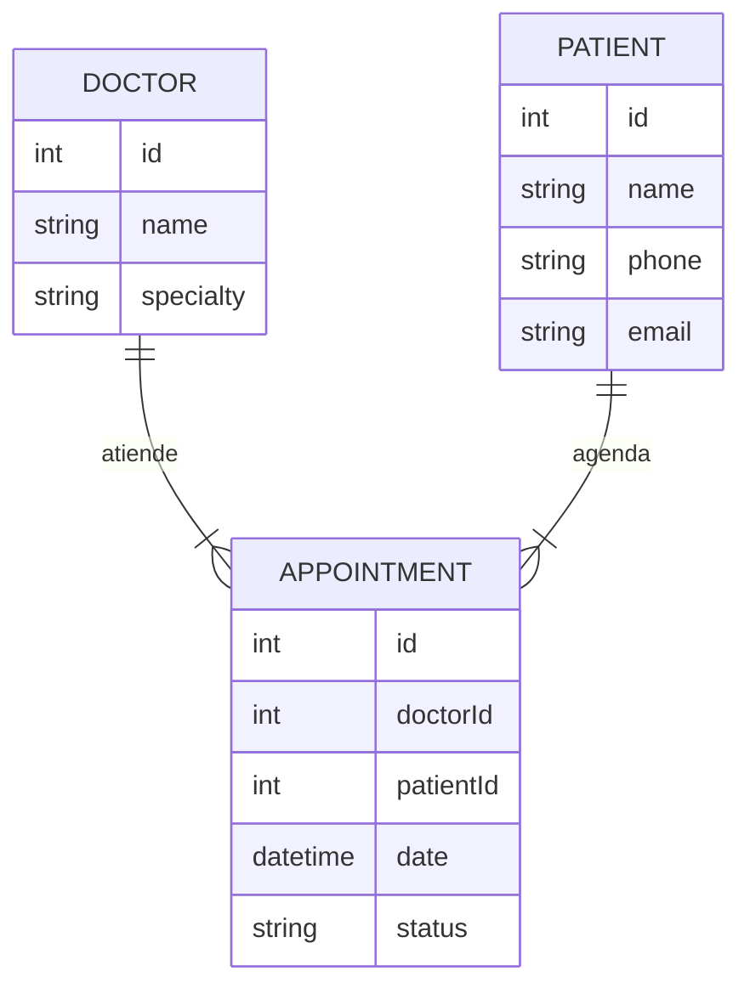

# 🏥 Sistema de Reservación de Citas Médicas

Proyecto **Fullstack** — Backend y Frontend en repos separados  
**Tecnologías:** PHP + MySQL + Angular 17 + TypeScript + Bootstrap 5  
**Equipo máximo:** 4 integrantes

---

## 📌 Descripción General

El Sistema de Reservación de Citas Médicas busca **digitalizar** la gestión de un consultorio que actualmente administra citas mediante:

- libretas,
- llamadas telefónicas,
- mensajería instantánea.

Este sistema permite:

- registrar doctores,
- registrar pacientes,
- programar y cancelar citas,
- administrar agendas médicas,
- consultar historial básico de citas.

Su enfoque es la **simplicidad y eficiencia**, ideal para consultorios pequeños o medianos.

---

## 🎯 Objetivos del Sistema

- Automatizar la programación de citas.
- Evitar duplicidad de horarios y conflictos de agenda.
- Mantener un registro organizado de doctores y pacientes.
- Permitir al personal administrativo y doctores gestionar sus agendas.
- Facilitar consultas por día, semana o doctor.

---

## 📦 Alcance del Proyecto

### ✔ Incluye
- CRUD **doctores**
- CRUD **pacientes**
- Gestión completa de **citas**
  - agendar
  - modificar
  - cancelar
  - confirmar
- Agenda médica con vista **diaria** y **semanal**
- **Roles:** Administrador y Doctor
- **Autenticación JWT**
- **SPA** con Angular

### ❌ No incluye (opcional)
- Historia clínica avanzada
- Plataforma para pacientes
- Integración con SMS/correo
- Expediente médico formal

---

## 🧩 Módulos del Sistema

### 1. Autenticación
- Inicio de sesión
- JWT
- Roles: `admin`, `doctor`

### 2. Doctores (CRUD)
- Nombre
- Especialidad
- Horarios disponibles *(opcional)*

### 3. Pacientes (CRUD)
- Datos generales
- Teléfono
- Enfermedades preexistentes *(opcional)*

### 4. Citas
- Agendar cita
- Editar cita
- Cancelar
- Confirmar cita
- Validación de horarios

### 5. Agenda
- Vista diaria
- Vista semanal
- Filtro por doctor

### 6. Dashboard
- Citas del día
- Próximas citas
- Cancelaciones recientes

---

## 👤 Historias de Usuario

### 👨‍⚕️ Doctor
> “Como doctor, quiero ver mi agenda del día para saber qué pacientes atender.”

> “Como doctor, quiero que el sistema evite duplicar citas en el mismo horario.”

### 👩‍💼 Administrador
> “Como administrador, quiero registrar nuevos pacientes de forma rápida.”

> “Como administrador, quiero agendar citas para distintos doctores disponibles.”

> “Como administrador, quiero cancelar citas para mantener la agenda actualizada.”

---

## 🛠 Tecnologías del Proyecto

### Backend
- PHP 8
- MySQL
- JWT
- PDO (conexión segura)
- SlimPHP *(opcional)*

### Frontend
- Angular 17
- TypeScript
- Bootstrap 5
- Angular Router
- HttpClient

---

## 📁 Arquitectura General del Proyecto

**Backend (PHP + MySQL):**
- Controladores (endpoints)
- Modelos (PDO)
- Servicios
- JWT
- Validaciones
- Rutas REST

**Frontend (Angular):**
- Rutas
- Componentes
- Formularios reactivos
- Servicios para consumir API
- Guards para roles y autenticación

---

## 📁 Estructura del Backend — Sistema de Citas Médicas (PHP + MySQL)

```plaintext
medical-backend/
├── public/
│   └── index.php                  # Punto de entrada principal del backend
├── app/
│   ├── config/
│   │   ├── database.php           # Configuración y conexión a MySQL (PDO)
│   │   └── env.php                # Carga de variables de entorno
│   ├── controllers/
│   │   ├── DoctorController.php   # Controlador de doctores (CRUD)
│   │   ├── PatientController.php  # Controlador de pacientes (CRUD)
│   │   └── AppointmentController.php  # Controlador de citas (agendar, editar, cancelar)
│   ├── models/
│   │   ├── Doctor.php             # Modelo ORM básico para doctores
│   │   ├── Patient.php            # Modelo para pacientes
│   │   └── Appointment.php        # Modelo para citas médicas
│   ├── routes/
│   │   └── api.php                # Definición de endpoints del sistema
│   ├── middleware/
│   │   └── AuthMiddleware.php     # Validación JWT para rutas protegidas
│   └── utils/
│       ├── JwtHelper.php          # Generación y verificación de tokens JWT
│       └── Response.php           # Helper estándar para respuestas JSON
├── .htaccess                       # URL rewriting para peticiones limpias
├── .env.example                    # Variables de entorno (DB, JWT_SECRET, etc.)
└── README.md                       # Documentación principal del backend
```

## 📁 Estructura del Frontend — Sistema de Citas Médicas (Angular 17 + Bootstrap)

```plaintext
medical-frontend/
├── src/app/
│   ├── core/
│   │   ├── guards/
│   │   │   └── auth.guard.ts                # Protege rutas según autenticación (JWT)
│   │   ├── interceptors/
│   │   │   └── token.interceptor.ts         # Interceptor para adjuntar token en cada petición
│   │   └── services/
│   │       ├── auth.service.ts              # Login, logout y manejo del token
│   │       ├── doctor.service.ts            # Servicio CRUD para doctores
│   │       ├── patient.service.ts           # Servicio CRUD para pacientes
│   │       └── appointment.service.ts       # Servicio para agendar / modificar / cancelar citas
│   ├── pages/
│   │   ├── login/                           # Pantalla de inicio de sesión
│   │   ├── dashboard/                       # Dashboard principal
│   │   ├── doctors/                         # Gestión de doctores (CRUD)
│   │   ├── patients/                        # Gestión de pacientes (CRUD)
│   │   └── appointments/                    # Gestión de citas (agenda diaria/semanal)
│   ├── shared/
│   │   ├── layout/
│   │   │   ├── sidebar.component.ts         # Menú lateral
│   │   │   └── navbar.component.ts          # Barra superior
│   │   └── components/                      # Componentes reutilizables
│   │       ├── form-field/                  # Campos de formulario reutilizables
│   │       └── modal/                        # Modales genéricos
│   └── app-routing.module.ts                 # Definición de rutas (públicas y protegidas)
└── main.ts                                   # Punto de entrada Angular
```

## 📘 Modelo ER — Sistema de Citas Médicas



## 📄 Entregables Finales

Cada equipo debe entregar los siguientes elementos para completar correctamente el proyecto:

### 🩺 Backend — API funcional (PHP + MySQL)
- Endpoints CRUD para doctores, pacientes y citas
- Autenticación JWT
- Validaciones
- Manejo de errores
- Archivo `.env.example`
- Documentación de endpoints

### 🧭 Frontend — SPA Angular
- Pantallas funcionales (login, dashboard, doctores, pacientes, agenda)
- Manejo de rutas protegidas con guard
- Formulario para citas (agendar, modificar, cancelar)
- Diseño responsivo con Bootstrap

### 🗄 Base de datos SQL
- Archivo `schema.sql` con todas las tablas
- Datos iniciales (`seed.sql` opcional)

### 📘 Manual de usuario
Debe incluir:
- Capturas de pantalla
- Flujo de trabajo (login → agenda → citas)
- Manual para registrar doctores, pacientes y citas

### 🛠 Manual técnico
Debe contener:
- Instalación del backend
- Instalación del frontend
- Variables de entorno
- Dependencias utilizadas
- Arquitectura y estructura de carpetas
- Postman Collection

### 🎬 Video demo completo
Duración sugerida: **3–6 minutos**  
Debe mostrar:
- Inicio de sesión
- CRUD de doctores y pacientes
- Agenda médica (diaria/semanal)
- Registro, edición, cancelación de citas
- Roles (admin/doctor)

### 📊 Diagramas requeridos
- **Diagrama ER** (Doctor–Paciente–Cita)
- **Diagrama de Arquitectura**
- **Flujo de Autenticación JWT**

---

## 🎨 Figma sugerido

UI de agendas médicas (moderna y responsiva):

👉 https://www.figma.com/community/file/1556285978188674402/doctor-appointment-ui-kit-persian-rtl

→ [HOME](./../README.md)