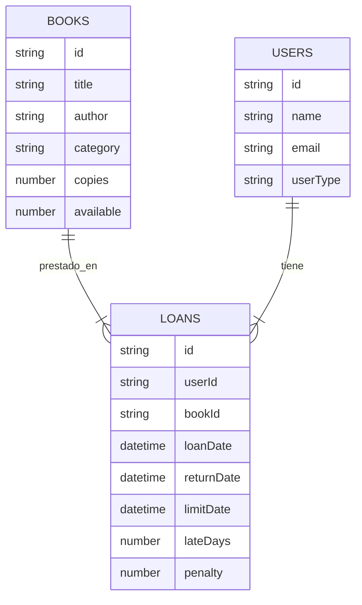

# 📚 Sistema de Biblioteca Digital

Proyecto **Fullstack** — Backend y Frontend por separado  
**Tecnologías:** Node.js + Express + Firebase Firestore + Vue 3 + Vuetify  
**Equipo máximo:** 4 integrantes

---

## 📌 Descripción General

El Sistema de Biblioteca Digital permite administrar libros, usuarios y préstamos dentro de una institución como:

- una biblioteca escolar,
- una biblioteca comunitaria,
- un pequeño centro de lectura.

El sistema permite saber en todo momento:

- qué libros están disponibles,
- cuáles están prestados y a quién,
- cuánto tiempo llevan fuera,
- qué usuarios tienen préstamos activos,
- el historial completo de operaciones.

El objetivo principal es **automatizar procesos que hoy se hacen en libretas o Excel**, evitando pérdida de libros y mejorando la organización interna.

---

## 🎯 Objetivos del Sistema

- Gestionar libros con toda su información.
- Registrar usuarios y controlar sus préstamos.
- Llevar control de préstamos y devoluciones.
- Consultar disponibilidad de libros en tiempo real.
- Generar reportes básicos para la administración.
- Ofrecer una interfaz moderna, intuitiva y responsiva.

---

## 📦 Alcance del Proyecto

### ✔ Incluye
- CRUD **Libros**
- CRUD **Usuarios**
- Registro de **Préstamos**
- **Devoluciones**
- Cálculo de **multas por retraso**
- Dashboard general
- **Roles:** Admin, Bibliotecario
- Autenticación **JWT**
- Interfaz con **Vuetify 3**

### ❌ No incluye (Opcional)
- Reservaciones automáticas
- Envío de correos
- Escaneo de códigos de barras
- Múltiples sucursales de biblioteca

---

## 🧩 Módulos del Sistema

### 1. Autenticación
- Login
- JWT
- Roles: `admin`, `bibliotecario`

### 2. Libros (CRUD)
Campos principales:
- Título  
- Autor  
- Categoría  
- Año  
- ISBN  
- Copias disponibles  

### 3. Usuarios (CRUD)
- Nombre
- Matrícula/ID
- Datos de contacto

### 4. Préstamos
- Registrar préstamo
- Reducir stock disponible
- Validar disponibilidad
- Calcular fecha estimada de devolución

### 5. Devoluciones
- Registrar devolución
- Calcular retraso
- Calcular multa (si aplica)
- Restaurar stock

### 6. Historial
- Consultar por libro
- Consultar por usuario
- Filtrar por estado (activo / devuelto)

### 7. Reportes
- Libros más prestados
- Usuarios más activos
- Préstamos activos en tiempo real

---

## 👤 Historias de Usuario

### 🧑‍🏫 Bibliotecario
> “Como bibliotecario quiero registrar nuevos libros para mantener actualizado el catálogo.”

> “Como bibliotecario quiero saber qué libros están prestados para dar seguimiento.”

### 👨‍💼 Administrador
> “Como administrador quiero ver cuántos préstamos se realizan al mes para analizar el movimiento de la biblioteca.”

> “Como administrador quiero gestionar usuarios y roles del sistema.”

---

## 🛠 Tecnologías del Proyecto

### Backend
- Node.js
- Express
- Firebase Admin SDK
- Firestore
- JWT
- Bcrypt

### Frontend
- Vue 3
- Vuetify 3
- Vue Router
- Axios

## 📁 Estructura del Backend — Biblioteca Digital (Node.js + Express + Firestore)

```plaintext
library-backend/
├── src/
│   ├── config/
│   │   ├── firebase.js                 # Configuración de Firebase Admin + conexión a Firestore
│   │   └── env.js                      # Carga de variables de entorno
│   ├── repositories/
│   │   ├── books.repository.js         # Acceso a datos: libros
│   │   ├── users.repository.js         # Acceso a datos: usuarios
│   │   └── loans.repository.js         # Acceso a datos: préstamos y devoluciones
│   ├── services/
│   │   ├── books.service.js            # Lógica de negocio para libros
│   │   ├── users.service.js            # Lógica de negocio para usuarios
│   │   └── loans.service.js            # Lógica de préstamos y devoluciones
│   ├── controllers/
│   │   ├── books.controller.js         # Controlador de libros (CRUD)
│   │   ├── users.controller.js         # Controlador de usuarios (CRUD)
│   │   └── loans.controller.js         # Controlador de préstamos/devoluciones
│   ├── routes/
│   │   ├── books.routes.js             # Rutas de libros
│   │   ├── users.routes.js             # Rutas de usuarios
│   │   └── loans.routes.js             # Rutas de préstamos
│   ├── middleware/
│   │   └── auth.middleware.js          # Validación de JWT
│   ├── utils/
│   │   ├── errorHandler.js             # Manejo global de errores
│   │   └── jwt.js                      # Generación y verificación de tokens
│   ├── app.js                          # Configuración principal de Express
│   └── server.js                       # Servidor HTTP
├── serviceAccountKey.json               # ❗ NO subir a GitHub (contiene llaves privadas)
├── .env.example                         # Variables de entorno: FIREBASE, JWT_SECRET, PORT
└── README.md                            # Documentación del backend
```

## 📁 Estructura del Frontend — Biblioteca Digital (Vue 3 + Vuetify)

```plaintext
library-frontend/
├── src/
│   ├── api/
│   │   ├── http.js                 # Instancia Axios con baseURL y token
│   │   ├── books.api.js            # Peticiones relacionadas con libros
│   │   └── loans.api.js            # Peticiones de préstamos / devoluciones
│   ├── store/
│   │   ├── auth.store.js           # Manejo de sesión (token, usuario)
│   │   └── books.store.js          # Estado global de libros
│   ├── router/
│   │   └── index.js                # Configuración de Vue Router (rutas protegidas)
│   ├── views/
│   │   ├── LoginView.vue           # Pantalla de inicio de sesión
│   │   ├── DashboardView.vue       # Dashboard principal del sistema
│   │   ├── BooksView.vue           # Vista de gestión de libros (CRUD)
│   │   ├── UsersView.vue           # Vista de usuarios registrados
│   │   └── LoansView.vue           # Vista de préstamos y devoluciones
│   ├── components/
│   │   ├── books/
│   │   │   └── BookForm.vue        # Formulario para agregar/editar libros
│   │   ├── users/                  # Componentes relacionados con usuarios
│   │   └── loans/                  # Componentes relacionados con préstamos
│   ├── App.vue                     # Componente raíz
│   └── main.js                     # Punto de entrada principal
└── .env.example                    # Variables de entorno (VITE_API_BASE_URL)
```

## 📘 Modelo de Datos — Firebase Firestore (ER Diagram)



## 📄 Entregables Finales

- **Backend funcional** (Node.js + Firestore)
- **Frontend completo** (Vue 3 + Vuetify 3)
- **Colección Postman** con todos los endpoints documentados
- **Diagramas**
  - Modelo **ER**
  - Diagrama de **Arquitectura**
- **Manual de usuario** (cómo usar el sistema)
- **Manual técnico** (instalación, estructura, API, despliegue)
- **Video demostrativo** del sistema funcionando

---

## 🎨 Figma Sugerido

Interfaz moderna para biblioteca digital:  
👉 https://www.figma.com/community/file/1014294740231740871/library-app-ui

→ [HOME](./../README.md)