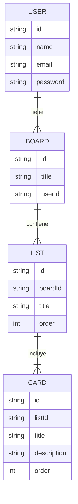

# 📌 Plataforma Kanban (Estilo Trello)

**Proyecto Fullstack — Backend y Frontend separados**  
**Tecnologías:** Node.js + TypeScript + MongoDB/Firebase + React + TailwindCSS  
**Equipo máximo:** 4 integrantes  

---

## 📘 Descripción General

La Plataforma Kanban es una aplicación que simula el funcionamiento de **Trello**:

- Crear tableros  
- Crear columnas  
- Crear tarjetas  
- Mover tarjetas mediante **Drag & Drop**  
- Autenticación con roles  
- Dashboard dinámico  

El proyecto enseña implementación de **CRUD avanzados**, organización de datos en colecciones relacionadas, manejo de UI interactiva y un flujo completo con autenticación.

Es ideal para practicar:

- Desarrollo moderno con React  
- Diseño limpio con TailwindCSS  
- API REST con Node.js  
- Arquitectura modular  
- Drag & Drop profesional  

---

## 🎯 Objetivos del Sistema

- Gestionar tableros personales por usuario.
- Administrar columnas dentro de cada tablero.
- Crear, editar y eliminar tarjetas.
- Mover tarjetas entre columnas usando drag & drop.
- Varios usuarios con tableros independientes.
- UI moderna tipo Trello.

---

## 📦 Alcance del Proyecto

### ✔ Incluye
- CRUD Tableros (Boards)  
- CRUD Columnas (Lists)  
- CRUD Tarjetas (Cards)  
- Sistema de autenticación (Register + Login)  
- Roles: Usuario normal y Admin (opcional)  
- Drag & Drop con **React DnD**  
- Dashboard con todos los tableros del usuario  
- SPA completa

### ❌ No incluye (opcional)
- Adjuntar archivos  
- Comentarios avanzados  
- Historial de actividades estilo Trello  
- Equipos colaborativos (solo tableros personales)

---

## 🧩 Módulos del Sistema

### 1. Autenticación
- Registro
- Login
- JWT
- Hash de contraseñas (bcrypt)
- Manejo de sesiones

### 2. Tableros (Boards)
- Crear, editar, eliminar
- Listado de tableros del usuario
- Compartir tableros (opcional)

### 3. Columnas (Lists)
- Crear, editar, eliminar
- Orden por usuario

### 4. Tarjetas (Cards)
- Crear, editar, eliminar
- Descripción
- Fecha de creación automática
- Asignado a (opcional)

### 5. Drag & Drop
- Cambiar tarjeta de columna
- Cambiar orden dentro de la misma columna
- React DnD

### 6. Dashboard
- Mostrar todos los tableros
- Tableros recientes
- Estadísticas opcionales

---

## 👤 Historias de Usuario

### Usuario
- “Como usuario, quiero crear tableros para organizar mis proyectos.”
- “Como usuario, quiero arrastrar tarjetas entre columnas para actualizar su estado.”
- “Como usuario, quiero ver todos mis tableros en un dashboard fácil de usar.”

### Administrador (opcional)
- “Como administrador, quiero ver usuarios registrados y gestionar la plataforma.”

---

## 🛠 Tecnologías del Proyecto

### Backend
- Node.js  
- TypeScript  
- Express  
- MongoDB o Firebase Firestore  
- JWT  
- Bcrypt  
- Zod (validaciones)

### Frontend
- React  
- Vite  
- TailwindCSS  
- React Router  
- **React DnD** para Drag & Drop  
- Axios  
- Zustand o Redux Toolkit  

---

# 📁 Estructura — kanban-backend/

```bash
kanban-backend/
├── src/
│   ├── config/
│   │   ├── db.ts                 # Conexión a MongoDB o Firestore
│   │   └── env.ts                # Variables de entorno
│   ├── models/
│   │   ├── board.model.ts        # Modelo de Tableros
│   │   ├── list.model.ts         # Modelo de Columnas
│   │   └── card.model.ts         # Modelo de Tarjetas
│   ├── repositories/
│   │   ├── board.repository.ts   # Consultas para tableros
│   │   ├── list.repository.ts    # Consultas para columnas
│   │   └── card.repository.ts    # Consultas para tarjetas
│   ├── services/                 # Lógica de negocio
│   ├── controllers/              # Controladores HTTP
│   ├── routes/
│   │   ├── auth.routes.ts        # Login / Register
│   │   ├── boards.routes.ts      # CRUD Tableros
│   │   ├── lists.routes.ts       # CRUD Columnas
│   │   └── cards.routes.ts       # CRUD Tarjetas
│   ├── middleware/
│   │   └── auth.middleware.ts    # Validación JWT
│   ├── utils/                    # Funciones auxiliares
│   ├── app.ts                    # App Express
│   └── server.ts                 # Servidor principal
├── .env.example                  # Variables de entorno de ejemplo
└── README.md                     # Documentación principal
```

# 📁 Estructura — kanban-frontend/

```bash
kanban-frontend/
├── src/
│   ├── api/
│   │   ├── http.ts              # Configuración de Axios
│   │   ├── boards.api.ts        # Peticiones para tableros
│   │   └── cards.api.ts         # Peticiones para tarjetas
│   ├── store/
│   │   ├── auth.store.ts        # Estado de autenticación
│   │   ├── boards.store.ts      # Estado de tableros
│   │   └── cards.store.ts       # Estado de tarjetas
│   ├── router/
│   │   └── index.tsx            # Rutas principales con React Router
│   ├── pages/
│   │   ├── LoginPage.tsx        # Página de login
│   │   ├── DashboardPage.tsx    # Listado de tableros del usuario
│   │   └── BoardPage.tsx        # Vista del tablero con columnas y tarjetas
│   ├── components/
│   │   ├── board/
│   │   │   ├── Column.tsx       # Columna con tarjetas
│   │   │   ├── Card.tsx         # Tarjeta individual
│   │   │   └── BoardHeader.tsx  # Encabezado del tablero
│   │   ├── layout/
│   │   │   ├── Sidebar.tsx      # Barra lateral
│   │   │   └── Navbar.tsx       # Barra superior
│   ├── App.tsx                  # Root component
│   └── main.tsx                 # Punto de entrada de React
└── .env.example                 # Variables de entorno
```

# 🧩 Modelo ER / Colecciones — Plataforma Kanban

A continuación se muestra el modelo Entidad–Relación utilizando sintaxis Mermaid para representar las colecciones del sistema Kanban:



# 📄 Entregables Finales — Plataforma Kanban (Estilo Trello)

### ✔ Backend funcional (Node + TypeScript + DB)
Incluye:
- API REST completa
- Gestión de usuarios, tableros, columnas y tarjetas
- Validaciones con Zod
- Autenticación JWT
- Conexión a MongoDB o Firebase Firestore
- Middlewares de seguridad

---

### ✔ Frontend funcional (React + TailwindCSS)
Incluye:
- SPA completa con React Router
- Gestión de sesión (Zustand o Redux Toolkit)
- UI moderna con TailwindCSS
- Manejo de tableros, columnas y tarjetas
- Integración total con la API

---

### ✔ Board con Drag & Drop
- Movimiento de tarjetas entre columnas
- Reordenamiento dentro de la misma columna
- Implementado con **React DnD** o **DndKit**

---

### ✔ Postman Collection
Debe contener:
- Auth (Register / Login)
- CRUD Tableros
- CRUD Columnas
- CRUD Tarjetas
- Ejemplos de peticiones protegidas con JWT

---

### ✔ Diagramas ER + Arquitectura
Incluye:
- Diagrama Entidad–Relación (Mermaid)
- Arquitectura Backend (Rutas → Controladores → Servicios → Repositorios → DB)
- Arquitectura Frontend (Páginas → Componentes → Store → API Layer)
- Flujo de autenticación con JWT

---

### ✔ Video Demo
Duración sugerida: **3 a 6 minutos**

Debe mostrar:
- Login / Registro
- Creación de un tablero
- Creación de columnas
- Creación de tarjetas
- Drag & Drop funcionando
- Gestión de tareas completa
- Vista del dashboard

---

### 🎨 Figma sugerido
UI inspirada en Trello / Kanban:

🔗 https://www.figma.com/community/file/899474868892160673/kanban-web-app-ui

→ [HOME](./../README.md)