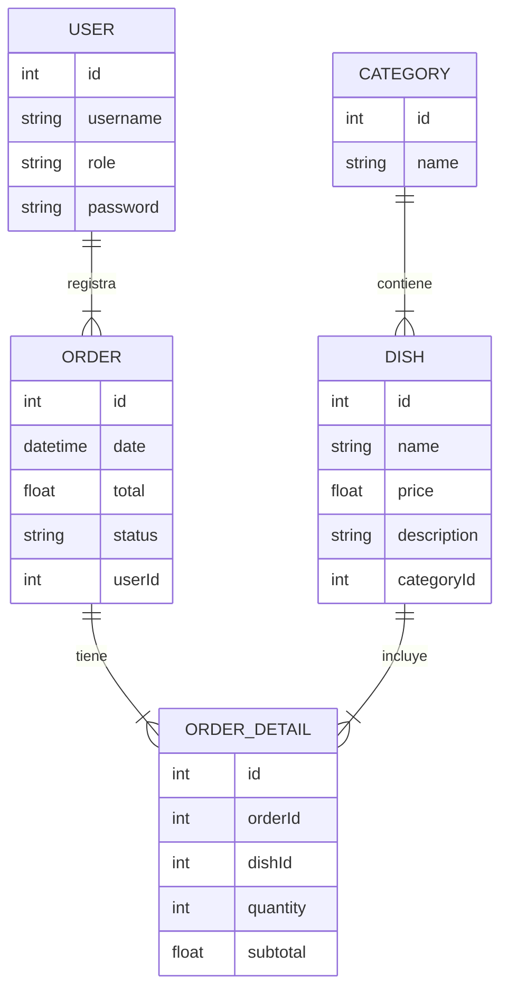

# 🍽 Sistema de Gestión de Restaurante

Proyecto **Fullstack** — Backend y Frontend en repos separados  
**Tecnologías:** Python (Flask) + MySQL + Angular + Bootstrap  
**Equipo máximo:** 4 integrantes

---

## 📌 Descripción General

El Sistema de Gestión de Restaurante permite administrar el menú, registrar órdenes de clientes, generar tickets y visualizar reportes de ventas.

Está orientado a pequeños restaurantes que actualmente manejan sus pedidos utilizando:

- cuadernos,
- tickets improvisados,
- notas de voz en WhatsApp,

lo cual genera errores, pérdida de información y procesos lentos.  
Este proyecto digitaliza por completo el flujo de pedidos y facilita el control diario de la operación.

---

## 🎯 Objetivos del Sistema

- Gestionar platillos y categorías del menú.
- Registrar órdenes con su detalle.
- Generar tickets para los clientes.
- Administrar el historial de ventas.
- Proveer dashboard con información diaria.
- Ofrecer una interfaz rápida, moderna y fácil de usar.

---

## 📦 Alcance del Proyecto

### ✔ Incluye
- CRUD **platillos**
- CRUD **categorías**
- Registro de **órdenes**
- **Ticket PDF** (opcional)
- Historial de órdenes
- Reporte de ventas por día
- Autenticación con JWT
- Roles: **Administrador** y **Mesero**
- SPA completa con Angular

### ❌ No incluye (opcional)

- Múltiples sucursales
- Impresoras térmicas
- Gestión de inventario
- Módulo de Delivery o repartidores

---

## 🧩 Módulos del Sistema

### 1. Autenticación
- Login
- JWT
- Roles: `admin`, `mesero`

### 2. Categorías (CRUD)
Tipos de categoría:
- Entradas  
- Platos fuertes  
- Postres  
- Bebidas  

### 3. Platillos (CRUD)
Información mínima:
- nombre  
- descripción  
- categoría  
- precio  
- disponibilidad  

### 4. Órdenes
- Registro de pedido  
- Selección de platillos  
- Cantidades  
- Total automático  
- Mesa (opcional)  

### 5. Ticket (opcional)
- Generación en PDF
- Fecha, número de orden, lista de productos

### 6. Historial
- Listado de pedidos realizados
- Filtro por fecha
- Estado de la orden: `tomada`, `servida`, `cancelada`

### 7. Reportes
- Ventas del día
- Totales por categoría

### 8. Dashboard
- Total de ventas hoy
- Total de órdenes
- Platillo más vendido

---

## 👤 Historias de Usuario

### 👨‍🍳 Mesero
- *"Como mesero quiero registrar órdenes rápido para atender más mesas."*
- *"Como mesero quiero editar una orden si el cliente cambia su solicitud."*

### 👨‍💼 Administrador
- *"Como administrador quiero administrar el menú para mantenerlo actualizado."*
- *"Como administrador quiero consultar reportes para saber el rendimiento del restaurante."*

---

## 🛠 Tecnologías del Proyecto

### Backend
- Python
- Flask
- MySQL
- SQLAlchemy
- Marshmallow (validaciones)
- Flask-Migrate (migraciones)
- JWT para autenticación

### Frontend
- Angular
- TypeScript
- Bootstrap 5
- Angular Router
- HttpClient

---

## 📁 Estructura del Backend — `restaurant-backend/`

```bash
restaurant-backend/
├── app/
│   ├── __init__.py
│   ├── config.py              # Configuración general (DB, JWT, variables de entorno)
│   ├── models/                # Modelos SQLAlchemy
│   │   ├── category.py        # Modelo Categoría
│   │   ├── dish.py            # Modelo Platillo
│   │   ├── order.py           # Modelo Orden
│   │   └── order_detail.py    # Detalle de Orden
│   ├── routes/                # Rutas / Endpoints
│   │   ├── categories.py      # CRUD categorías
│   │   ├── dishes.py          # CRUD platillos
│   │   ├── orders.py          # Registro de órdenes
│   │   └── auth.py            # Login y JWT
│   ├── services/              # Lógica de negocio
│   │   ├── category_service.py
│   │   ├── dish_service.py
│   │   └── order_service.py
│   ├── utils/                 # Utilidades generales
│   │   ├── jwt_helper.py      # Generación y validación de JWT
│   │   └── validators.py      # Validaciones Marshmallow o manuales
│   └── migrations/            # Archivos generados por Flask-Migrate
├── venv/                      # Entorno virtual
├── .env.example               # Variables de entorno de ejemplo
└── README.md                  # Documentación del backend
```

## 📁 Estructura del Frontend — `restaurant-frontend/`

```bash
restaurant-frontend/
├── src/app/
│   ├── core/                         # Núcleo del sistema (servicios, guards, interceptores)
│   │   ├── guards/                   # Guards para proteger rutas con JWT
│   │   ├── interceptors/             # Interceptores para agregar token y manejar errores
│   │   └── services/                 # Servicios HTTP (Angular HttpClient)
│   │       ├── auth.service.ts       # Login, logout, manejo de JWT
│   │       ├── dishes.service.ts     # CRUD platillos
│   │       ├── categories.service.ts # CRUD categorías
│   │       └── orders.service.ts     # Registro de órdenes e historial
│   ├── pages/                        # Páginas principales de la aplicación
│   │   ├── login/                    # Pantalla de autenticación
│   │   ├── dashboard/                # Indicadores y métricas
│   │   ├── menu/                     # Gestión del menú (categorías + platillos)
│   │   ├── orders/                   # Registro de pedidos
│   │   ├── history/                  # Historial de órdenes
│   │   └── reports/                  # Reportes de ventas
│   ├── shared/                       # Componentes y layout compartidos
│   │   ├── layout/
│   │   │   ├── navbar/               # Barra superior
│   │   │   └── sidebar/              # Menú lateral
│   │   └── components/               # Componentes reutilizables (tablas, modales, etc.)
│   └── app-routing.module.ts         # Módulo de rutas de Angular
└── main.ts                           # Punto de entrada de la aplicación Angular
```

## 📊 Modelo Entidad–Relación (ER) — Restaurante



## 📄 Entregables Finales

### ✔ Backend completo (Flask + MySQL)

Incluye:

- API REST funcional  
- Modelos en SQLAlchemy  
- Migraciones con Flask-Migrate  
- Controladores y servicios  
- Validaciones  
- Autenticación con JWT  
- Archivo `.env` y configuración base  

---

### ✔ Frontend completo (Angular)

Incluye:

- SPA completa  
- Rutas protegidas  
- Diseño con Bootstrap  
- Servicios `HttpClient` para consumir API  
- Dashboard, menú, pedidos, reportes  

---

### ✔ SQL de tablas

Archivo `schema.sql` con la estructura de:

- `categories`  
- `dishes`  
- `orders`  
- `order_details`  
- `users`  

Incluye relaciones, llaves primarias y llaves foráneas.

---

### ✔ Dashboard + Reportes

- Ventas del día  
- Totales por categoría  
- Productos más vendidos  
- Historial de pedidos  
- Resumen de actividad  

---

### ✔ Video demostrativo

Debe mostrar:

- Login  
- Registro de orden  
- Gestión de menú  
- Dashboard  
- Reportes  
- Flujo completo del sistema  

📌 **Duración sugerida:** 3 a 6 minutos.

---

### ✔ Diagramas ER y arquitectura

Incluye:

- 👉 Diagrama Entidad–Relación completo  
- 👉 Diagrama de arquitectura backend (Flask)  
- 👉 Diagrama de arquitectura frontend (Angular)  
- 👉 Flujo de autenticación JWT  

---

### ✔ Postman con endpoints

La colección incluye:

- Login  
- CRUD categorías  
- CRUD platillos  
- CRUD órdenes  
- Rutas protegidas con token  
- Ejemplos de respuestas  


## 🎨 Figma sugerido

UI profesional para restaurantes:  
👉 https://www.figma.com/community/file/1089266249998767115/restaurant-management-dashboard-ui

→ [HOME](./../README.md)
