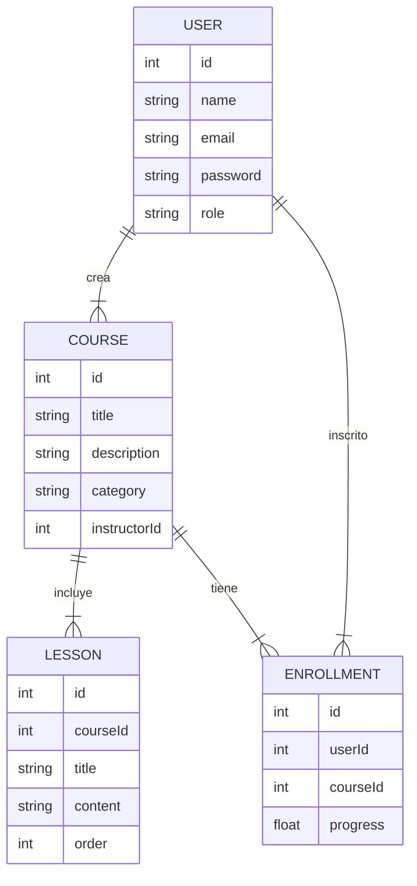

# 📘 Plataforma Mini-Udemy (Sistema de Cursos Online)

Proyecto Fullstack — Backend y Frontend en repos separados  
Tecnologías: **PHP + MySQL + Vue 3 + TailwindCSS**  
Equipo máximo: **4 integrantes**

---

## 📌 Descripción General

La Plataforma Mini-Udemy es un sistema de cursos en línea que permite:

- que instructores registren cursos y suban contenido,
- que alumnos se inscriban y consuman los cursos,
- que se lleve un control de lecciones, progreso e inscripción.

Está inspirada en plataformas como **Udemy, Platzi y Coursera**, en una versión simplificada.

El objetivo principal es que los alumnos desarrolladores implementen un flujo completo:

- autenticación,  
- administración de cursos,  
- player de contenido,  
- inscripción de usuarios,  
- frontend SPA conectado a un backend REST.

---

## 🎯 Objetivos del Sistema

- Permitir la creación y administración de cursos.
- Gestionar lecciones dentro de cada curso.
- Permitir que alumnos se inscriban a cursos.
- Reproducir contenido educativo (video o texto).
- Llevar registro del progreso del alumno.
- Proveer un panel de administración para instructores.

---

## 📦 Alcance del Proyecto

### ✔ Incluye

- CRUD cursos  
- CRUD lecciones  
- Inscripción de alumnos  
- Player educativo (video o lectura)  
- Seguimiento de progreso del alumno  
- Dashboard  
- Autenticación JWT  
- Roles: **Admin, Instructor, Alumno**

### ❌ No incluye (opcional)

- Pagos reales  
- Gamificación avanzada  
- Subida de videos al backend (se permite usar links de YouTube)  
- Chats, foros o mensajería interna  

---

## 🧩 Módulos del Sistema

### 1. Autenticación
- Login  
- Registro  
- Roles (admin, instructor, alumno)  
- JWT  

### 2. Cursos (CRUD)
- Nombre  
- Descripción  
- Categoría  
- Imagen (opcional)  
- Instructor asignado  

### 3. Lecciones (CRUD)
- Título  
- Contenido en texto o video (YouTube link)  
- Orden dentro del curso  

### 4. Inscripciones
- Alumno se inscribe a un curso  
- Validación para evitar inscripciones duplicadas  

### 5. Player de Lecciones
- Reproducción o visualización del contenido  
- Marcar como completada  

### 6. Progreso
- Porcentaje del curso  
- Lecciones completadas  

### 7. Dashboard
- Cursos creados  
- Alumnos inscritos  
- Avances  

---

## 👤 Historias de Usuario

### 🎓 Alumno
- *"Como alumno quiero ver las lecciones para aprender un tema."*  
- *"Como alumno quiero ver mi progreso para saber cuánto me falta."*

### 👨‍🏫 Instructor
- *"Como instructor quiero crear cursos para mis alumnos."*  
- *"Como instructor quiero subir nuevas lecciones a mis cursos."*

### 👑 Administrador
- *"Como administrador quiero gestionar usuarios para controlar la plataforma."*  
- *"Como administrador quiero ver estadísticas globales de cursos."*

---

## 🛠 Tecnologías del Proyecto

### Backend
- PHP 8  
- MySQL  
- JWT  
- PDO  
- Composer  
- Slim Framework *(opcional)*  

### Frontend
- Vue 3  
- TailwindCSS  
- Pinia  
- Vue Router  
- Axios  

---

## 📁 Estructura del Backend — `courses-backend/`

```plaintext
courses-backend/
├── public/
│   └── index.php                   # Punto de entrada del backend (Front Controller)
├── app/
│   ├── config/
│   │   ├── database.php            # Conexión a MySQL mediante PDO
│   │   └── env.php                 # Variables de entorno (cargadas desde .env)
│   ├── controllers/
│   │   ├── CourseController.php    # Controlador para CRUD de cursos
│   │   ├── LessonController.php    # Controlador para CRUD de lecciones
│   │   ├── UserController.php      # Registro, login y gestión de usuarios
│   │   └── EnrollmentController.php# Control de inscripciones
│   ├── models/
│   │   ├── Course.php              # Modelo del curso
│   │   ├── Lesson.php              # Modelo de lecciones
│   │   ├── User.php                # Modelo de usuario (roles)
│   │   └── Enrollment.php          # Modelo de inscripciones
│   ├── routes/
│   │   └── api.php                 # Definición de rutas de la API (REST)
│   ├── middleware/
│   │   └── AuthMiddleware.php      # Middleware JWT para proteger rutas
│   └── utils/
│       ├── JwtHelper.php           # Generación y validación de JWT
│       └── Response.php            # Respuestas estándar JSON
├── .htaccess                       # Redirección hacia /public (Apache)
├── .env.example                    # Archivo de ejemplo para configuración
└── README.md                       # Documentación del backend
```

## 🎨 Estructura del Frontend — `courses-frontend/`

```plaintext
courses-frontend/
├── src/
│   ├── api/
│   │   ├── http.js                # Axios configurado con baseURL y token
│   │   ├── auth.api.js            # Login, registro, validación de JWT
│   │   ├── courses.api.js         # CRUD de cursos
│   │   └── lessons.api.js         # CRUD de lecciones
│   ├── store/
│   │   ├── auth.store.js          # Estado global de autenticación (Pinia)
│   │   ├── courses.store.js       # Estado global de cursos
│   │   └── player.store.js        # Estado del reproductor (progreso, lección actual)
│   ├── router/
│   │   └── index.js               # Rutas públicas/protegidas (Vue Router)
│   ├── views/
│   │   ├── LoginView.vue          # Página de inicio de sesión
│   │   ├── CoursesView.vue        # Listado de cursos disponibles
│   │   ├── CourseDetailView.vue   # Vista de detalles e inscripción del curso
│   │   ├── LessonView.vue         # Player del curso (video/lectura + progreso)
│   │   └── DashboardView.vue      # Dashboard de Admin/Instructor
│   ├── components/
│   │   ├── courses/               # Componentes relacionados con cursos
│   │   ├── lessons/               # Componentes del player de lecciones
│   │   └── ui/                    # Botones, modales, inputs reutilizables
│   ├── App.vue                    # Root component
│   └── main.js                    # Entry point del proyecto Vue 3
└── .env.example                   # Variables de entorno (URL API, etc.)
```

## 🗄️ Modelo de Datos — Mini-Udemy (ER Diagram)



## 📄 Entregables Finales

### ✔ Backend con API REST
Incluye:
- Endpoints para cursos, lecciones, usuarios e inscripciones  
- Autenticación con JWT  
- Controladores, modelos y middleware  
- Conexión a base de datos (MySQL)

### ✔ Frontend SPA completo
Incluye:
- Navegación con Vue Router  
- Manejo de estado con Pinia  
- Player de contenido para lecciones  
- Dashboard y vistas para cursos y progreso  

### ✔ SQL de tablas
Archivo `schema.sql` con la estructura de:
- `users`
- `courses`
- `lessons`
- `enrollments`
- Relaciones y llaves foráneas incluidas

### ✔ Dashboard
Incluye:
- Cursos creados  
- Alumnos inscritos  
- Progreso  
- Actividad reciente  

### ✔ Player funcional
- Visualización de lecciones  
- Soporte para texto o video (YouTube embed)  
- Marcado de progreso por lección  

### ✔ Video demostrativo
El video debe mostrar:
- Login / Registro  
- Navegación por cursos  
- Player de lecciones  
- Inscripción a cursos  
- Vista de progreso  
- Dashboard administrativo  
**Duración sugerida:** 3–6 minutos

### ✔ Diagramas ER y arquitectura
Incluye:
- Diagrama Entidad–Relación (MER)  
- Arquitectura del backend  
- Arquitectura del frontend  
- Flujo de autenticación con JWT  

### ✔ Postman Collection
Colección con endpoints:
- Login / Registro  
- CRUD cursos  
- CRUD lecciones  
- Inscripciones  
- Rutas protegidas  
- Ejemplos de respuestas

---

## 🎨 Figma sugerido
UI moderna para plataformas educativas:  
👉 https://www.figma.com/community/file/1219518338793572590/online-course-app-ui

→ [HOME](./../README.md)