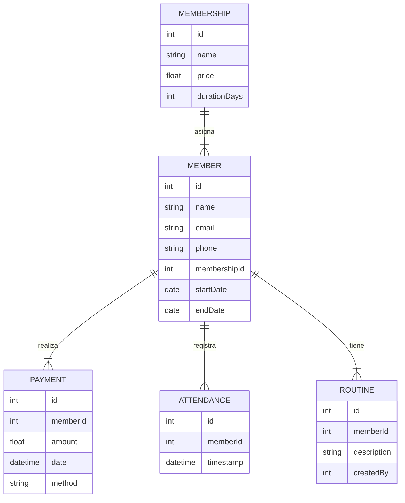

# 🏋️ Sistema de Gestión de Gimnasio — GymFit Manager

Proyecto Fullstack — Backend y Frontend separados  
**Tecnologías:** Node.js + TypeScript + MySQL + React + TailwindCSS  
**Equipo máximo:** 4 integrantes

---

## 📌 Descripción General

El sistema **GymFit Manager** administra los procesos principales de un gimnasio moderno:

- Registro de socios  
- Administración de membresías  
- Control de asistencias  
- Pagos  
- Rutinas personalizadas  
- Métricas e indicadores

Su propósito es reemplazar los cuadernos y hojas de cálculo que muchos gimnasios utilizan, ofreciendo una solución profesional, rápida y fácil de usar.

---

## 🎯 Objetivos del Sistema

- Gestionar socios y sus datos personales.  
- Administrar tipos de membresías.  
- Registrar asistencias con fecha/hora.  
- Controlar pagos y estatus de membresía.  
- Asignar rutinas personalizadas por instructor.  
- Mostrar métricas y reportes clave.  
- Proveer un sistema seguro y escalable con roles y JWT.

---

## 📦 Alcance del Proyecto

### ✔ Incluye
- CRUD de socios  
- CRUD de empleados *(opcional)*  
- CRUD de membresías  
- Registro y control de pagos  
- Control de asistencias  
- Rutinas personalizadas  
- Dashboard administrativo  
- Roles: Admin, Instructor, Recepción  
- Autenticación con JWT  
- SPA en React  

### ❌ No Incluye (opcional)
- Control financiero avanzado  
- Múltiples turnos  
- Torniquetes / RFID  
- Facturación  

---

## 🧩 Módulos del Sistema

### 1) Autenticación y Roles
- Login con JWT  
- Roles disponibles:
  - **Admin**
  - **Instructor**
  - **Recepcionista**

---

### 2) Socios (CRUD)
- Datos personales  
- Estatus (activo / inactivo)  
- Membresía asignada  

---

### 3) Membresías
- Tipos de plan:
  - Mensual
  - Semanal
  - Anual
  - Premium  
- Precios  
- Vigencias  

---

### 4) Pagos
- Registro de pagos  
- Historial del socio  
- Estatus de membresía  
- Alertas de vencimiento (simple)  

---

### 5) Asistencias
- Registro automático de entrada  
- Fecha y hora  
- Historial consultable  

---

### 6) Rutinas
- Asignación por instructor  
- Ejercicios  
- Series, repeticiones, peso *(opcional)*  
- Seguimiento del avance  

---

### 7) Dashboard
- Socios activos  
- Asistencias del día  
- Membresías por vencer  
- Gráficas de rendimiento  

---

## 👤 Historias de Usuario

### 🧑‍💼 Administrador
- "Como administrador quiero registrar nuevos socios para mantener actualizado el gimnasio."
- "Como administrador quiero ver cuántas personas asistieron hoy."

### 🧑‍🏫 Instructor
- "Como instructor quiero asignar rutinas personalizadas a mis alumnos."

### 🧑‍💼 Recepcionista
- "Como recepcionista quiero registrar asistencias rápidamente al llegar un socio."

---

## 🛠 Tecnologías del Proyecto

### Backend
- Node.js  
- TypeScript  
- Express  
- MySQL  
- Prisma ORM *(o Sequelize)*  
- JWT  
- Bcrypt  
- Zod (validaciones)

### Frontend
- React  
- Vite  
- TailwindCSS  
- React Router  
- Zustand o Redux Toolkit  
- Axios  

## 📁 Estructura del Backend — `gymfit-backend/`

```plaintext
gymfit-backend/
├── src/
│   ├── config/
│   │   ├── env.ts                     # Variables de entorno y configuración
│   │   └── db.ts                      # Conexión a MySQL (Prisma/Sequelize)
│   ├── models/
│   │   ├── member.model.ts            # Modelo: Socio
│   │   ├── membership.model.ts        # Modelo: Membresías
│   │   ├── payment.model.ts           # Modelo: Pagos
│   │   ├── attendance.model.ts        # Modelo: Asistencias
│   │   └── routine.model.ts           # Modelo: Rutinas
│   ├── repositories/
│   │   ├── member.repository.ts       # Lógica de acceso a datos: Socios
│   │   ├── membership.repository.ts   # Lógica de acceso a datos: Membresías
│   │   ├── payment.repository.ts      # Pagos
│   │   ├── routine.repository.ts      # Rutinas
│   │   └── attendance.repository.ts   # Asistencias
│   ├── services/
│   │   ├── member.service.ts          # Reglas de negocio para socios
│   │   ├── membership.service.ts      # Reglas de negocio para membresías
│   │   ├── payment.service.ts         # Reglas de negocio para pagos
│   │   ├── routine.service.ts         # Reglas de negocio para rutinas
│   │   └── attendance.service.ts      # Reglas de negocio para asistencias
│   ├── controllers/
│   │   ├── member.controller.ts       # Endpoints socios
│   │   ├── membership.controller.ts   # Endpoints membresías
│   │   ├── payment.controller.ts      # Endpoints pagos
│   │   ├── routine.controller.ts      # Endpoints rutinas
│   │   └── attendance.controller.ts   # Endpoints asistencias
│   ├── routes/
│   │   ├── member.routes.ts           # Rutas socios
│   │   ├── membership.routes.ts       # Rutas membresías
│   │   ├── payment.routes.ts          # Rutas pagos
│   │   ├── routine.routes.ts          # Rutas rutinas
│   │   └── attendance.routes.ts       # Rutas asistencias
│   ├── middleware/
│   │   ├── auth.middleware.ts         # Autenticación JWT
│   │   └── role.middleware.ts         # Roles (admin, instructor, recepcionista)
│   ├── utils/
│   │   ├── jwt.ts                     # Generación/validación de tokens
│   │   └── errorHandler.ts            # Manejo de errores centralizado
│   ├── app.ts                         # Configuración general de Express
│   └── server.ts                      # Servidor principal
├── prisma/                            # Esquema Prisma (si se usa)
├── .env.example                       # Variables de entorno de ejemplo
└── README.md                          # Documentación del backend
```

## 📁 Estructura del Frontend — `gymfit-frontend/`

```plaintext
gymfit-frontend/
├── src/
│   ├── api/
│   │   ├── http.ts                 # Configuración Axios + Interceptores JWT
│   │   ├── members.api.ts          # API de socios
│   │   ├── payments.api.ts         # API de pagos
│   │   └── routines.api.ts         # API de rutinas
│   ├── store/
│   │   ├── auth.store.ts           # Store de autenticación (Zustand/Redux)
│   │   ├── members.store.ts        # Estado de socios
│   │   ├── routines.store.ts       # Estado de rutinas
│   │   └── attendance.store.ts     # Estado de asistencias
│   ├── router/
│   │   └── index.tsx               # Rutas + Protección por roles
│   ├── pages/
│   │   ├── LoginPage.tsx           # Pantalla de login
│   │   ├── DashboardPage.tsx       # Dashboard con métricas
│   │   ├── MembersPage.tsx         # Gestión de socios
│   │   ├── MembershipsPage.tsx     # Tipos de membresías
│   │   ├── PaymentsPage.tsx        # Pagos e historial
│   │   ├── AttendancePage.tsx      # Registro y consulta de asistencias
│   │   └── RoutinesPage.tsx        # Rutinas personalizadas
│   ├── components/
│   │   ├── members/
│   │   │   └── MemberForm.tsx      # Formulario de socios
│   │   ├── routines/               # Componentes de rutinas
│   │   └── ui/                     # Componentes UI reutilizables
│   ├── App.tsx                     # Root component
│   └── main.tsx                    # Punto de entrada de React
└── .env.example                    # Variables de entorno
```

## 🗂️ Modelo ER — GymFit Manager (Mermaid)



## 📄 Entregables Finales — GymFit Manager

### ✔ Backend funcional (Node + TypeScript + MySQL)
Incluye:
- API REST completa
- Modelos con Prisma o Sequelize
- Validaciones con Zod
- Autenticación con JWT
- Hash de contraseñas con Bcrypt
- Middlewares de roles y autenticación
- Archivo `.env` con variables de entorno
- Estructura modular (controllers, services, repositories)

---

### ✔ Frontend funcional (React + TailwindCSS)
Incluye:
- SPA completa
- Login con token JWT
- Rutas protegidas
- Dashboard con tarjetas y gráficas
- Gestión completa de socios, membresías, pagos, rutinas y asistencias
- Zustand o Redux Toolkit para estado
- Axios con interceptores

---

### ✔ Dashboard completo
Debe mostrar:
- Socios activos
- Asistencias del día
- Membresías por vencer
- Total de pagos recibidos
- Gráficas de progreso

---

### ✔ Base de datos SQL
Archivo `schema.sql` con:
- Tabla `members`
- Tabla `memberships`
- Tabla `payments`
- Tabla `attendance`
- Tabla `routines`
- Llaves primarias y foráneas
- Relaciones uno-a-muchos

---

### ✔ Postman Collection
Debe contener:
- Login
- CRUD socios
- CRUD membresías
- CRUD pagos
- CRUD rutinas
- Registro de asistencias
- Rutas protegidas por token
- Ejemplos de request/response

---

### ✔ Video demostrativo (3–5 min)
Debe mostrar:
1. Login y roles  
2. Dashboard  
3. Alta de socio  
4. Registro de asistencia  
5. Registro de pago  
6. Asignación de rutinas  
7. Reportes y métricas

---

### ✔ Diagramas ER + Arquitectura
Debe incluir:
- Diagrama Entidad–Relación (ER)  
- Diagrama de Arquitectura Backend (Node + TS)  
- Diagrama Arquitectura Frontend (React + Tailwind)  
- Flujo de autenticación JWT  

---

### 🎨 Figma sugerido
UI profesional para gimnasios:  
👉  https://www.figma.com/community/file/1201837911051993512/gym-management-dashboard-ui

→ [HOME](./../README.md)